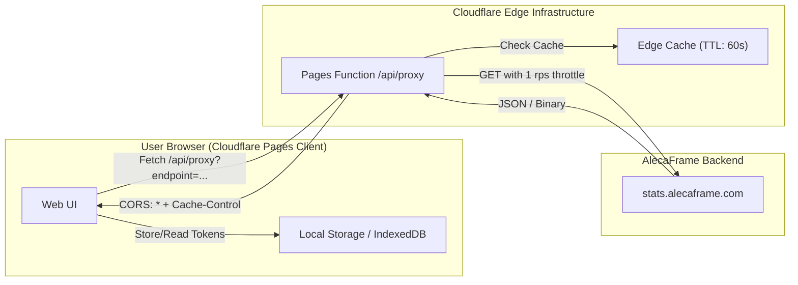

# AlecaFrame Public Token Integration & Architecture Research

## 1. Executive Summary & Scope Clarification

AlecaFrame (a Warframe companion application operating on the Overwolf platform) provides a cloud-based **Stats API** hosted at `https://stats.alecaframe.com`. Through this service, players can generate a **Public Token** (or "Public Link") that allows third-party tools to fetch specific, permissioned game statistics without exposing private credentials or the user's permanent internal `userHash`.

### Critical Scope Distinction
Before architectural design, it is essential to distinguish between what the **Public Token** exposes over the internet versus what resides purely on the player's local machine:

| Feature / Data Category | Available via Public Token (`stats.alecaframe.com`) | Available Locally Only (`%localappdata%/AlecaFrame`) |
| :--- | :---: | :---: |
| **Relic Inventory** (All eras, tiers, counts) | **Yes** (Dedicated binary endpoint) | Yes |
| **Trade History** (Itemized transactions, Plat, timestamps) | **Yes** (Detailed JSON payload) | Yes |
| **Wealth & Progression Snapshots** (Plat, Credits, Endo, Ducats, Aya) | **Yes** (Time-series data points) | Yes |
| **Account Progress** (Mastery Rank, % Completion) | **Yes** (In data points) | Yes |
| **Live Arsenal / Owned Warframes & Weapons** | ❌ No | **Yes** (in `lastData.dat` / game memory) |
| **Mod Collection & Inventory Quantities** | ❌ No | **Yes** (in `lastData.dat` / game memory) |
| **Foundry State & Crafting Timers** | ❌ No | **Yes** (in local app cache) |

> [!NOTE]
> Community tools that provide full arsenal and inventory inspection (such as `browse.wf`) require the user to upload their local `%localappdata%/AlecaFrame/lastData.dat` file directly in the browser. For an automated, remote web tool relying solely on an **AlecaFrame Public Token**, the importable data comprises **Relic Inventories**, **Historical Trade Records**, and **Progression/Currency Metrics**.

---

## 2. AlecaFrame Public Token Architecture

### 2.1 Token Generation Workflow
1. The user launches AlecaFrame (running with Overwolf).
2. Navigates to the **Stats** tab.
3. Selects **"Create Public Link"**.
4. Checks the specific scopes they wish to authorize (e.g., Relics, Trades, Platinum).
5. Clicks **"Generate token"**.

### 2.2 Security & Lifespan Characteristics
- **Anonymity & GDPR:** The token does not reveal Warframe email, passwords, or Steam IDs.
- **Isolation:** The user's permanent identifier (`userHash`) remains protected; sharing the public token only exposes data matching the authorized bitmask.
- **Expiration:** Tokens are valid for up to **1 year** from creation.
- **Revocability:** Users can revoke the token at any time inside the AlecaFrame app, invalidating future API calls immediately.

### 2.3 Permission Scopes: The `PublicLinkParts` Bitmask
AlecaFrame manages data access using an integer bitmask (`PublicLinkParts`):

| Bit Flag | Value | Scope Name | Data Granted |
| :---: | :---: | :--- | :--- |
| `1 << 0` | **1** | `Trades` | Complete itemized trade history (tx/rx items, plat, user) |
| `1 << 1` | **2** | `Platinum` | Historical Platinum balance snapshots |
| `1 << 2` | **4** | `Ducats` | Historical Ducat balance snapshots |
| `1 << 3` | **8** | `Endo` | Historical Endo balance snapshots |
| `1 << 4` | **16** | `Credits` | Historical Credit balance snapshots |
| `1 << 5` | **32** | `AccountData` | Mastery Rank (`mr`) and completion percentage (`percentageCompletion`) |
| `1 << 6` | **64** | `Aya` | Historical Aya balance snapshots |
| `1 << 7` | **128** | `Relics` | Access to `/api/stats/public/getRelicInventory` |

When evaluating an incoming payload, a bitwise check verifies user permissions:
```typescript
const canReadRelics = (publicParts & 128) === 128;
const canReadTrades = (publicParts & 1) === 1;
```

---

## 3. API Endpoints & Payload Specifications

Base URL: `https://stats.alecaframe.com`

### 3.1 Endpoint: Get Public Stats (`/api/stats/public`)
- **HTTP Method:** `GET`
- **Query Parameter:** `token` (string, required) — The public token string.
- **Response Format:** `application/json`

#### Schema Breakdown (`PlayerStatsData`):
```typescript
interface PlayerStatsData {
  lastUpdate: string;             // ISO-8601 Timestamp
  userHash?: string | null;       // Null or masked for public tokens
  usernameWhenPublic?: string;    // In-game Warframe username at token creation
  publicParts: number;            // Bitmask flag (PublicLinkParts)
  generalDataPoints?: PlayerStatsDataPoint[];
  trades?: PlayerStatsTrade[];
}

interface PlayerStatsDataPoint {
  ts: string;                     // ISO-8601 Timestamp of snapshot
  plat?: number;                  // Platinum balance
  credits?: number;               // Credits balance (int64)
  endo?: number;                  // Endo balance
  ducats?: number;                // Ducats balance
  aya?: number;                   // Aya balance
  relicOpened?: number;           // Lifetime relics opened counter
  trades?: number;                // Lifetime trades counter
  mr?: number;                    // Mastery Rank
  percentageCompletion?: number;  // Profile completion % (0-100)
}

interface PlayerStatsTrade {
  ts: string;                     // Transaction ISO-8601 Timestamp
  type: 0 | 1 | 2;                // 0 = Sale, 1 = Purchase, 2 = Item-for-Item Trade
  user?: string;                  // Counterpart player username
  totalPlat?: number;             // Net platinum transferred (positive or null)
  tx?: TradedObjectInfo[];        // Items sent by the player
  rx?: TradedObjectInfo[];        // Items received by the player
}

interface TradedObjectInfo {
  name: string;                   // Internal item name (e.g. "/Lotus/Types/Recipes/...")
  displayName: string;            // Human-readable name (e.g. "Braton Prime Barrel")
  cnt: number;                    // Quantity transferred
  rank: number;                   // Mod rank (if applicable, else 0)
}
```

---

### 3.2 Endpoint: Get Relic Inventory (`/api/stats/public/getRelicInventory`)
- **HTTP Method:** `GET`
- **Query Parameter:** `publicToken` (string, required) — Note the parameter name differs (`publicToken` vs `token`).
- **Prerequisite:** Token must have bit `128` (`Relics`) enabled in `publicParts`.
- **Response Format:** Binary buffer or base64-encoded byte array (described in Swagger as `type: string, format: byte`).

#### Binary Layout Specification (Little-Endian):
The payload packs the entire relic inventory in a highly compressed binary format:

1. **Header (4 bytes):**
   - `Uint32` (Little Endian): Total number of distinct relic entries ($N$).
2. **Relic Records ($N$ consecutive 9-byte structures):**
   - **Byte 0 (`Uint8`):** Relic Era
     - `0` = Lith
     - `1` = Meso
     - `2` = Neo
     - `3` = Axi
     - `4` = Requiem
   - **Byte 1 (`Uint8`):** Refinement Quality
     - `0` = Intact
     - `1` or `4` = Exceptional
     - `2` or `5` = Flawless
     - `3` or `6` = Radiant
   - **Bytes 2–4 (`char[3]`):** Relic Identifier
     - 3-byte ASCII string representing the relic code (e.g., `"L1\0"`, `"B21"`, `"N2\0"`).
   - **Bytes 5–8 (`Uint32` Little Endian):** Owned Quantity.

#### Pure JavaScript / TypeScript Binary Decoder:
```typescript
interface ParsedRelic {
  era: 'Lith' | 'Meso' | 'Neo' | 'Axi' | 'Requiem';
  refinement: 'Intact' | 'Exceptional' | 'Flawless' | 'Radiant';
  name: string;
  fullName: string;
  count: number;
}

export function parseRelicBinary(buffer: ArrayBuffer): ParsedRelic[] {
  const view = new DataView(buffer);
  const decoder = new TextDecoder('ascii');
  const count = view.getUint32(0, true);
  const relics: ParsedRelic[] = [];

  const ERA_MAP: Record<number, ParsedRelic['era']> = {
    0: 'Lith',
    1: 'Meso',
    2: 'Neo',
    3: 'Axi',
    4: 'Requiem'
  };

  const REFINEMENT_MAP: Record<number, ParsedRelic['refinement']> = {
    0: 'Intact',
    1: 'Exceptional',
    2: 'Flawless',
    3: 'Radiant',
    4: 'Exceptional',
    5: 'Flawless',
    6: 'Radiant'
  };

  for (let i = 0; i < count; i++) {
    const offset = 4 + (i * 9);
    if (offset + 9 > buffer.byteLength) break;

    const eraCode = view.getUint8(offset);
    const refCode = view.getUint8(offset + 1);
    
    // Read 3-byte ASCII string and strip null terminators
    const rawNameBytes = new Uint8Array(buffer, offset + 2, 3);
    const relicCode = decoder.decode(rawNameBytes).replace(/\0/g, '').trim();
    
    const quantity = view.getUint32(offset + 5, true);
    
    const era = ERA_MAP[eraCode] || 'Lith';
    const refinement = REFINEMENT_MAP[refCode] || 'Intact';

    relics.push({
      era,
      refinement,
      name: relicCode,
      fullName: `${era} ${relicCode}`,
      count: quantity
    });
  }

  return relics;
}
```

---

## 4. Network Architecture: Cloudflare Pages & CORS Resolution



### 4.1 The CORS Constraint
Direct browser `fetch('https://stats.alecaframe.com/api/...')` from a web application hosted on `https://<project>.pages.dev` triggers browser CORS failures if the upstream server does not issue `Access-Control-Allow-Origin: *`.

### 4.2 Solution: Cloudflare Pages Functions
Cloudflare Pages provides a built-in serverless edge routing feature via the `/functions` directory:
- **No separate server or Cloudflare Worker setup needed:** Deploying a single git repository deploys both the frontend and the proxy functions.
- **Cost:** Free tier includes 100,000 requests/day.
- **Edge Caching & Rate-Limit Shield:** AlecaFrame enforces a strict limit of **1 request per second per IP** (burst queue of 30). Placing edge caching (60–300s TTL) on the Cloudflare Pages Function ensures the user never encounters HTTP 429 errors during multiple page views or UI filtering.

#### Sample Cloudflare Pages Function (`functions/api/alecaframe.js`):
```javascript
export async function onRequest(context) {
  const url = new URL(context.request.url);
  const endpoint = url.searchParams.get('endpoint'); // 'stats' or 'relics'
  const token = url.searchParams.get('token');

  if (!token) {
    return new Response(JSON.stringify({ error: 'Missing token' }), {
      status: 400,
      headers: { 'Content-Type': 'application/json' }
    });
  }

  let targetUrl = '';
  if (endpoint === 'stats') {
    targetUrl = `https://stats.alecaframe.com/api/stats/public?token=${encodeURIComponent(token)}`;
  } else if (endpoint === 'relics') {
    targetUrl = `https://stats.alecaframe.com/api/stats/public/getRelicInventory?publicToken=${encodeURIComponent(token)}`;
  } else {
    return new Response(JSON.stringify({ error: 'Invalid endpoint' }), { status: 400 });
  }

  // Check Cloudflare Edge Cache
  const cacheKey = new Request(targetUrl, context.request);
  const cache = caches.default;
  let response = await cache.match(cacheKey);

  if (!response) {
    const upstream = await fetch(targetUrl, {
      headers: {
        'User-Agent': 'TennoLink-CFPages/1.0',
        'Accept': endpoint === 'relics' ? 'application/octet-stream, application/json' : 'application/json'
      }
    });

    if (!upstream.ok) {
      return new Response(JSON.stringify({ 
        error: `Upstream error: ${upstream.statusText}`, 
        status: upstream.status 
      }), {
        status: upstream.status,
        headers: {
          'Content-Type': 'application/json',
          'Access-Control-Allow-Origin': '*'
        }
      });
    }

    // Clone response to add CORS & caching headers
    const newHeaders = new Headers(upstream.headers);
    newHeaders.set('Access-Control-Allow-Origin', '*');
    newHeaders.set('Cache-Control', 'public, max-age=60'); // 1 minute edge cache

    response = new Response(upstream.body, {
      status: upstream.status,
      headers: newHeaders
    });

    context.waitUntil(cache.put(cacheKey, response.clone()));
  }

  return response;
}
```

---

## 5. Client-Side Browser Storage Architecture

### 5.1 Storage Distribution Model

```
Browser Storage
├── localStorage (Lightweight, synchronous, persistent)
│   ├── active_token_id: string
│   └── user_tokens: Array<{ id, label, token, lastSync, publicParts, username }>
│
└── IndexedDB (Binary & deep JSON records)
    ├── store: 'relic_inventories'
    │   └── key: token_id -> ParsedRelic[]
    ├── store: 'trade_history'
    │   └── key: token_id -> PlayerStatsTrade[]
    └── store: 'progression_timeline'
        └── key: token_id -> PlayerStatsDataPoint[]
```

### 5.2 Rationale: `localStorage` vs. `IndexedDB`
1. **`localStorage` Quota Limits:** 
   - `localStorage` is restricted to ~5MB per origin.
   - While a public token string is only ~36–64 characters, an active trader's trade log (`trades[]`) over several years can exceed 5–15MB of raw JSON.
   - Parsing large JSON blocks out of `localStorage` blocks the browser main UI thread.
2. **IndexedDB for Payload Caching:**
   - Supports hundreds of megabytes asynchronously.
   - Native storage for `ArrayBuffer` objects, enabling direct retention of the raw relic binary buffer.
   - Offline-First: The user can load and view their full relic inventory and trade journal without re-querying the API on every page reload.

---

## 6. Functional Capabilities for the Web Tool

Integrating the AlecaFrame Public Token unlocks specific community-requested features:

### 1. Relic Vault & Squad Radshare Matcher
- **Vault Status Matching:** Connect the parsed relic list with public Warframe drop tables (via `warframestat.us` or `browse.wf` data) to highlight vaulted relics vs unvaulted relics.
- **Squad / Clan Relic Aggregator:** Multiple players can provide their public tokens. The web app aggregates all four members' relic inventories in browser storage to identify shared relics for 4-player Radiant shares (*Radshares*).
- **Ducat & Plat Estimator:** Multiply relic drop rates by current `warframe.market` item values to calculate expected value (EV) per relic.

### 2. Personal Wealth & Progression Analytics
- **Historical Net Worth Curve:** Chart Platinum, Credits, Ducats, and Endo over time using the `generalDataPoints` timeline.
- **Trade Ledger & Merchant Analytics:** Filter trades by counterpart, item category, profit margin, or date range. Calculate total Platinum earned from Prime parts vs Mods.

---

## 7. Next Steps & Implementation Roadmap

1. **Verify Token & CORS Live:** Validate live response headers with a real sample token to verify whether direct fetch is permitted or if the Cloudflare Pages Function is required.
2. **Initialize Repository Structure:** Set up the Cloudflare Pages layout (`/public` for static assets and `/functions` for the edge proxy).
3. **Build Core Modules:**
   - Storage service (`tokenStorage.ts` and `db.ts`).
   - Binary relic parser (`relicDecoder.ts`).
   - Upstream API client with backoff and rate-limiting safeguards.
4. **Build UI Viewports:**
   - Token Management / Multi-profile switcher.
   - Relic Explorer with Era/Refinement filters and vault indicators.
   - Trade History & Progression Dashboards.
