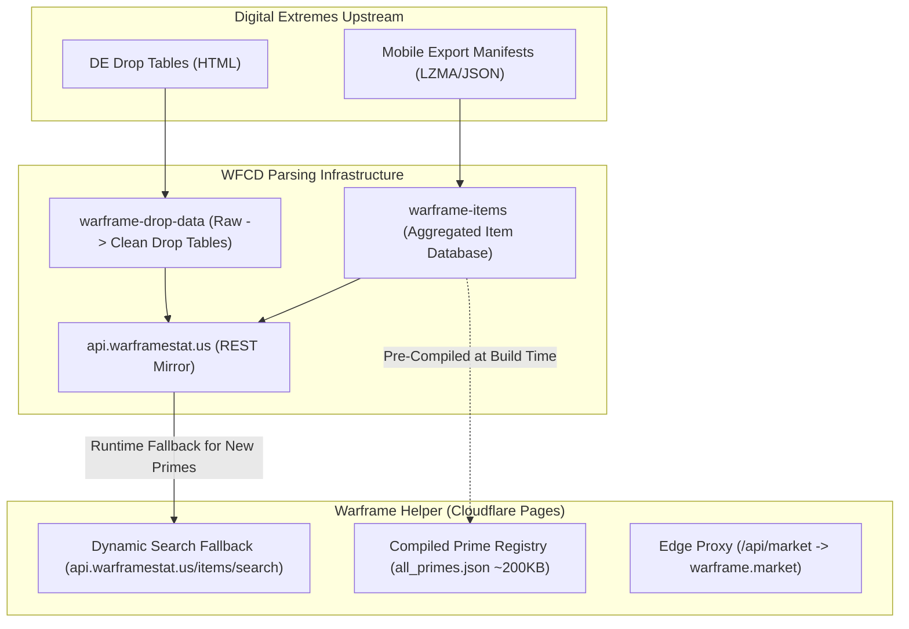
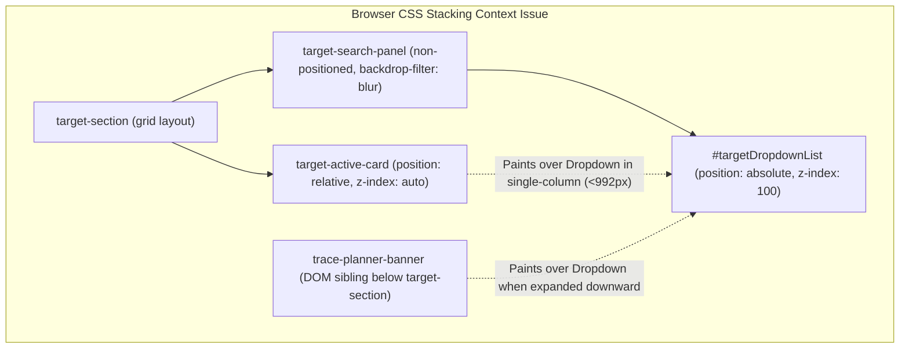

# Research Deepdive: Prime Source of Truth, Market Integration & UI Architecture

## 1. Executive Summary & Objective

This research deepdive addresses two primary objectives:
1. **Prime Data Pipeline & Market Tooling:** Identifying the definitive, canonical source of truth for all Prime items (Warframes, Weapons, Companions, Archwings), mapping relic and component acquisition sources (farming nodes and vault states), and integrating real-time `warframe.market` price intelligence for individual parts and complete sets.
2. **UI & Stacking Context Diagnostics:** Analyzing why the target search panel breaks and clips beneath adjacent cards, detailing the CSS stacking context interactions (`backdrop-filter`, `z-index`, `overflow`), and designing a collision-free UI architecture.

---

## 2. Source of Truth for Prime Items & Components

### 2.1 The Data Dilemma in the Warframe Ecosystem
Digital Extremes (DE) does not provide a single unified JSON REST API for third-party websites. Instead, DE provides:
- Raw HTML drop tables at `warframe.com/droptables` (unstructured, >200,000 lines).
- Compressed public export manifests at `content.warframe.com/MobileExport/Manifest/` (raw asset names like `/Lotus/Powersuits/Cowgirl/MesaPrime`).

Community tools bridge this using the **WFCD (Warframe Community Developers)** ecosystem:



### 2.2 Recommended Architecture: Hybrid Static + Dynamic Fallback

| Architecture Option | Latency | Reliability & Offline | Maintenance | Completeness |
| :--- | :---: | :---: | :---: | :---: |
| **Option A: Dynamic Fetch on every query** (`api.warframestat.us/items/search/`) | 300–1200ms | Fails if API has downtime or CORS blip | Zero build maintenance | 100% |
| **Option B: Full Dump at App Startup** (`api.warframestat.us/items`) | 2–5 seconds (~35MB download) | High memory usage; crashes mobile browsers | None | 100% |
| **Option C: Pre-Compiled Prime Registry** (`data/all_primes.json`) | **< 15ms** | **100% offline & instant** | Requires periodic dataset refresh | 100% of released Primes |
| **Option D: Hybrid (Option C + Dynamic Fallback)** | **< 15ms** | **Resilient to upstream failures** | Automated | **100% + Zero-Day updates** |

#### Why Hybrid is Optimal:
1. **Catalog Scope:** There are currently **45+ Prime Warframes** and **120+ Prime Weapons/Items** in the game.
2. **Compact Size:** A structured JSON containing *every single Prime item in Warframe history* with components, ducat values, and relic drop lists is only **~180–220 KB uncompressed** (and **~40 KB gzipped**).
3. **Zero Latency:** Typing in the search input yields instantaneous 60fps suggestions without sending HTTP network requests on every keystroke.
4. **Zero-Day Insurance:** If a new Prime releases today, any search query not found in the local bundle triggers a fallback lookup to `https://api.warframestat.us/items/search/{query}`.

---

## 3. Relic Drop Locations & Acquisition Reference

Warframe relics fall into two distinct operational states:

### 3.1 State 1: Vaulted Relics
- **Mission Drops:** **None.** They cannot be earned from standard starchart missions, bounties, or Void fissures.
- **Acquisition Channels:**
  1. **Existing Fireteam Stock:** What the squad sync engine displays from member tokens.
  2. **Prime Resurgence:** Purchased from Varzia in Maroo's Bazaar using Aya (earned from bounties and Void capture).
  3. **Player-to-Player Trading:** Purchased from other players on `warframe.market` using Platinum.

### 3.2 State 2: Active / Unvaulted Relics (Farming Meta)
Active relics drop from specific mission reward rotations. The community maintains dedicated high-yield nodes:

| Relic Era | Best Canonical Node | Mission Type & Planet | Rotations & Mechanics |
| :--- | :--- | :--- | :--- |
| **Lith** | **Hepit** | Capture, The Void | Guaranteed relic/Aya upon capture (sub-60s runs). |
| **Meso** | **Ukko** | Capture, The Void | 50% Meso / 50% Neo drop pool (sub-60s runs). |
|  | **Io** | Defense, Jupiter | Fast Rotation A rewards (waves 5 & 10). |
| **Neo** | **Ukko** | Capture, The Void | Speed runs (co-drops with Meso). |
|  | **Ur** | Disruption, Uranus | Rotations B & C drop Neo relics reliably. |
| **Axi** | **Apollo** | Disruption, Lua | The community gold standard. Maintaining conduits yields Tier 3 Rotation B & C Axi drops every round. |
|  | **Xini** | Interception, Eris | Guaranteed Neo on Rot A; guaranteed Axi on Rot B & C. |

> [!TIP]
> **Passive Relic Stocking:** Players can also purchase **Relic Packs** (3 random relics with guaranteed rare/uncommon weighting) from active Syndicates for 20,000 Standing or from Teshin in the Relay for 15 Steel Essence.

---

## 4. Warframe.Market API Integration Architecture

### 4.1 Upstream Rules & Constraints
Warframe.market provides public APIs for order books and market statistics, but enforces strict client rules:
1. **Mandatory Custom User-Agent:** Requests without a custom `User-Agent` (or with generic browser/curl headers) receive **HTTP 403 Forbidden**. Format: `WarframeHelper/1.0 (+https://github.com/Thecat8413/warframe-helper)`.
2. **Rate Limits:** Enforces **3 requests per second**. Rapid requests trigger Cloudflare IP blocking.
3. **No Direct Browser Fetch:** Because of Cloudflare bot protection and CORS policies, market requests must pass through our Cloudflare Pages edge proxy.

### 4.2 Endpoint Specifications

#### 1. Live Orders (Find Lowest In-Game Sell Price):
- **URL:** `GET https://api.warframe.market/v1/items/{item_url_name}/orders`
- **Filter Algorithm:**
  - `order.order_type === 'sell'`
  - `order.user.status === 'ingame'` (filters out offline sellers)
  - Sort by `order.platinum` ascending $\to$ index `[0]` gives the current **Buy-It-Now** market price.

#### 2. Historical Statistics (48-Hour & 90-Day Moving Averages):
- **URL:** `GET https://api.warframe.market/v1/items/{item_url_name}/statistics`
- **Payload:** Returns `statistics_closed['48hours']` and `statistics_closed['90days']` including median price, average price, and volume traded.

#### Item URL Slug Mapping:
| Item Name | Warframe.market URL Slug |
| :--- | :--- |
| **Glaive Prime Set** | `glaive_prime_set` |
| **Glaive Prime Blade** | `glaive_prime_blade` |
| **Glaive Prime Blueprint** | `glaive_prime_blueprint` |
| **Protea Prime Set** | `protea_prime_set` |
| **Protea Prime Systems** | `protea_prime_systems` |
| **Mesa Prime Set** | `mesa_prime_set` |

### 4.3 Edge Proxy Architecture (`/functions/api/market.js`)
To keep the frontend fast and ensure compliance with Warframe.market's rate limits:
- The Cloudflare Pages Function attaches the required `User-Agent`.
- Caches responses in the Cloudflare Edge Cache for **5 minutes** (`Cache-Control: public, max-age=300`).
- Prevents 429 rate limit errors when multiple squad members look up items simultaneously.

---

## 5. UI Diagnostic & Stacking Context Analysis

### 5.1 Root Cause of Search Panel Occlusion

The bug where the search dropdown renders behind or beneath adjacent panels is caused by three compounding CSS stacking context and DOM structure behaviors:



1. **`backdrop-filter` Stacking Context Trapping:**
   - Both `.target-search-panel` and `.target-active-card` use class `.glass-panel`, which applies `backdrop-filter: blur(16px)`.
   - In CSS specification (CSS Compositing and Blending Level 1), applying `backdrop-filter` creates a **new stacking context and containing block** for all descendant elements.
   - Therefore, `z-index: 100` on `#targetDropdownList` is evaluated *only inside* `.target-search-panel`. It cannot escape above subsequent sibling elements in the DOM.
2. **Sibling Ordering & Positioning:**
   - `.target-active-card` has `position: relative` (line 198 of `components.css`).
   - In standard CSS rendering, a positioned sibling (`position: relative`) that appears later in the DOM tree paints **on top of** prior non-positioned siblings.
   - On screens $\le 992\text{px}$ (or when the grid stacks), `.target-active-card` sits directly beneath `.target-search-panel`, occluding the absolute dropdown.
3. **Semi-Transparent Glass Background:**
   - `#targetDropdownList` was inheriting the `.glass-panel` background (`rgba(17, 24, 39, 0.75)`), causing background text and borders from lower cards to bleed through and produce visual distortion.

### 5.2 Resolution Plan
1. **Explicit Stacking Levels:**
   - Assign `.target-section` `position: relative; z-index: 30;`.
   - Assign `.target-search-panel` `position: relative; z-index: 40;`.
   - Assign `.search-input-wrapper` `position: relative; z-index: 50;`.
2. **Opaque Floating Dropdown Surface:**
   - Replace glassmorphism on `#targetDropdownList` with an opaque, high-contrast dark surface: `background: #0d131f; border: 1px solid var(--border-gold); box-shadow: 0 20px 40px rgba(0, 0, 0, 0.9); z-index: 9999;`.
3. **Layout Separation:**
   - Refactor the Target Deck into a unified command header where the search bar and the active target card do not share an overlapping vertical trajectory.

---

## 6. Implementation Blueprint

```
/Volumes/DevRepos/warframe-helper/
├── functions/
│   └── api/
│       ├── alecaframe.js         # Existing AlecaFrame Public Token Proxy
│       └── market.js             # NEW: Warframe.market Edge Proxy (5-min cache, User-Agent)
├── src/
│   ├── data/
│   │   ├── allPrimes.js          # NEW: Complete dataset of ALL 45+ Prime Warframes & 120+ Weapons
│   │   └── relicFarmingNodes.js  # NEW: Canonical farming mission locations per era (Hepit, Apollo, etc.)
│   ├── js/
│   │   ├── marketClient.js       # NEW: Warframe.market price aggregator (lowest sell, 90d avg)
│   │   ├── searchController.js   # REFACTORED: Stacking-safe combobox with keyboard navigation
│   │   └── app.js                # Integrated view coordinator
│   └── css/
│       ├── components.css        # Fixed z-index stacking & market pricing badges
│       └── market.css            # NEW: Part price indicators & set valuation chips
```
